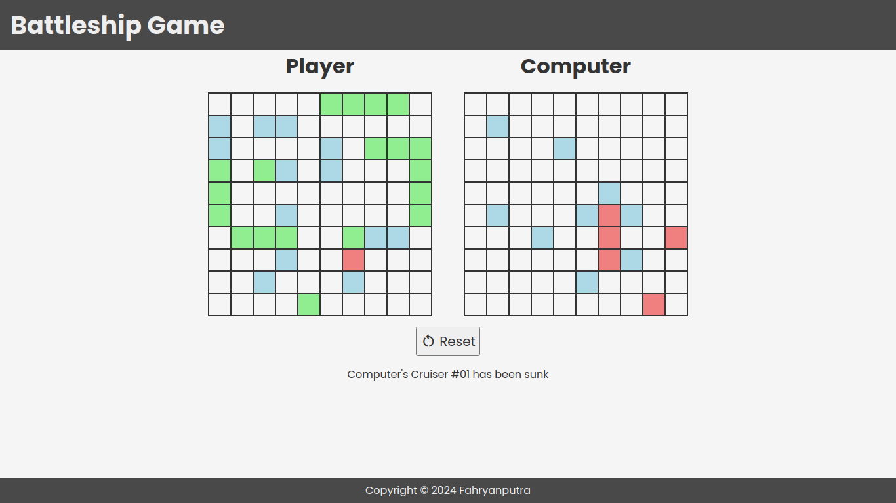

# Battleship Browser Game

Battleship is a strategic two-player board game where opponents secretly position their fleet of ships on a grid. Players take turns calling out coordinates to target and sink each other's ships. The goal is to be the first to destroy the opponent's entire fleet.

## Demo

[Link to live demo](https://fahryanputra.github.io/battleship-game/)

## Built With

- HTML
- CSS
- Javascript
- Webpack

## Authors

- Github: [@fahryanputra](https://www.github.com/fahryanputra)
- Email: [fahryandi.herlasmara@gmail.com](fahryandi.herlasmara@gmail.com)

## Acknowledgements

- [battleship-game.org](http://en.battleship-game.org/)
- [Google Font](https://fonts.google.com/)
